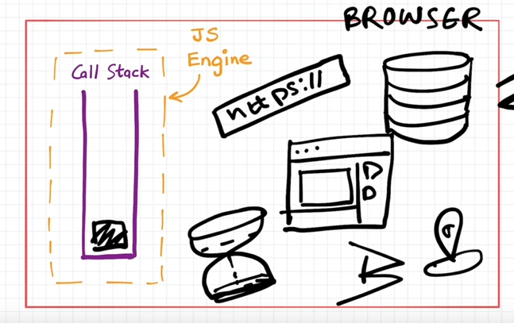
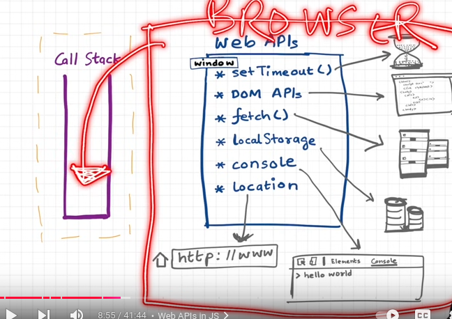
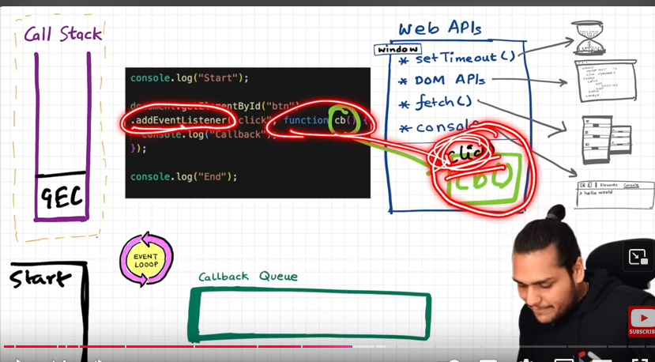
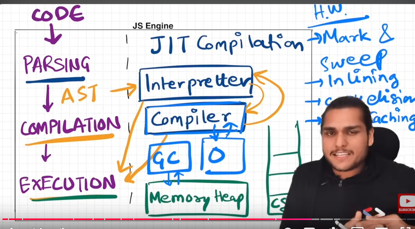
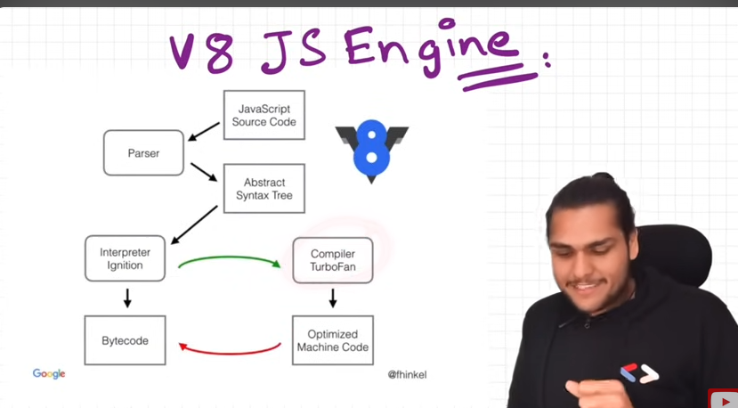

# u can preview it to see the images;
# https://youtu.be/8zKuNo4ay8E?si=tJZrQtuu9traBQOr

[]
# Js runtime components
The JavaScript runtime is an environment that enables JavaScript code to execute. It provides essential components and tools for the language to interact with the system, manage asynchronous operations, and handle input/output tasks. Below is an overview of the main components in a typical JavaScript runtime, such as those found in browsers and Node.js:

1. Call Stack

    Definition: The call stack is a data structure that keeps track of function calls.
    
    Role:
       
        Functions are pushed onto the stack when invoked.
        They are popped off the stack once their execution completes.

2. Heap

    Definition: A memory structure for dynamic allocation.
    
    Role:
       
        Stores objects and functions.
        Provides space for variables that don't have a fixed size, like arrays or objects.

3. Web APIs/Node APIs

    Definition: APIs provided by the host environment (browser or Node.js) to handle tasks like DOM manipulation, network requests, or file system operations.
   
    Examples:
       
        Web APIs (Browser): 
            setTimeout(), fetch(), DOM Manipulation, console.log()
        
        Node.js APIs: 
            fs for file system operations, http for server requests.
4. Task Queues

    Microtask Queue:
        
        Contains tasks like Promise callbacks (.then, .catch) and MutationObserver.
        Higher priority than macrotasks.
    
    Macrotask Queue:
       
        Contains tasks like setTimeout, setInterval, and I/O callbacks.

5. Event Loop

    Definition: The event loop coordinates the execution of tasks, managing the interaction between the call stack and the task queues.
    
    Role:
        
        Continuously checks if the call stack is empty.
        If empty, it dequeues tasks from the microtask queue first, then from the macrotask queue.

6. Callback Queue

    Definition: A queue where asynchronous task callbacks (from Web/Node APIs) are stored after execution.
    
    Role: Tasks in this queue wait to be executed when the call stack is empty.

7. V8 Engine (or other JavaScript Engines)

    Definition: The core engine responsible for executing JavaScript.
    
    Role:
        Parses the JavaScript code.
        Converts it to bytecode and, using JIT (Just-In-Time) compilation, optimizes it into machine code for faster execution.
    
    Example Engines:
         V8 (Chrome, Node.js)
         SpiderMonkey (Firefox)
         JavaScriptCore (Safari)

Js runtime Environment

 callback is registeres and the event listner is attached int the web apis or node js runtime for the eventlistner

The event loop in JavaScript is a critical component of the language's runtime model, allowing it to handle asynchronous operations despite being single-threaded. It ensures that non-blocking operations (like I/O tasks, timers, and network requests) are executed efficiently.
Key Concepts

    Single-Threaded Nature:
        JavaScript runs in a single thread, meaning only one task executes at a time.
        However, asynchronous tasks don't block the main thread, thanks to the event loop.

    Call Stack:
        A stack structure where function calls are pushed and popped.
        When the stack is empty, the event loop checks for tasks in other queues.

    Web APIs/Node APIs:
        Asynchronous tasks like setTimeout, fetch, or database queries are delegated to Web APIs or Node APIs.
        These APIs handle the operations in the background.

    Task Queues:
        Microtask Queue: Contains tasks like Promise callbacks (.then, .catch, .finally) or MutationObserver.
        Macrotask Queue: Contains tasks like setTimeout, setInterval, or I/O.

How the Event Loop Works

    Execute Synchronous Code:
        Starts by executing code in the call stack (synchronous tasks).

    Handle Asynchronous Tasks:
        Asynchronous tasks are sent to Web APIs/Node APIs.
        Once completed, their callbacks are pushed to the respective queue.

    Process Microtasks First:
        After the call stack is empty, the event loop checks the microtask queue and executes all pending microtasks.

    Process Macrotasks:
        Once all microtasks are processed, the event loop picks the first task from the macrotask queue and executes it.

    Repeat:
        This cycle continues endlessly as long as the program runs.
# Js engine (JIT compilation)

What is JIT?

JIT (Just-In-Time) Compilation is a technique used in modern JavaScript engines (like V8 in Chrome and Node.js, or SpiderMonkey in Firefox) to optimize the execution of JavaScript code. It combines the advantages of both interpretation and compilation.
How JIT Works:

    Parsing and Interpreting:
        Initially, the JavaScript engine reads the code and quickly converts it into bytecode (an intermediate representation).
        The bytecode is interpreted and executed immediately.

    Profiling and Optimization:
        While the code is running, the engine monitors frequently executed parts (called hot code).
        It recompiles these sections into machine code for faster execution.

    Fallback and De-Optimization:
        If assumptions about the code (e.g., variable types) change during execution, the engine can revert to slower bytecode execution or adjust optimizations dynamically.

Is JavaScript Interpreted or Compiled?

JavaScript is both interpreted and compiled, depending on the context and phase of execution:

    Interpreted:
        Early JavaScript engines (before modern JIT compilers) were purely interpreted.
        The code was read, converted into bytecode, and directly executed.

    Compiled:
        Modern engines use JIT compilation to compile frequently used code into highly optimized machine code.
        This process improves performance while maintaining flexibility.

Advantages of JIT:

    Faster execution: Frequently used code is compiled to machine code.
    Dynamic optimization: Adapts based on actual runtime behavior.
    Startup speed: Interpretation allows the program to start executing quickly.

Modern JavaScript Engines:

    V8 (Google Chrome, Node.js): Uses JIT to optimize execution.
    SpiderMonkey (Firefox): Also employs JIT.

Example Workflow in V8:

    Source code → Parsed into AST (Abstract Syntax Tree).
    AST → Converted into bytecode.
    JIT Compilation: Optimizes frequently run code into machine code.
    If assumptions break, it can revert to interpreted bytecode.

Summary:

    JavaScript is interpreted in its initial phase for fast startup.
    It is compiled during execution via JIT for improved performance.

