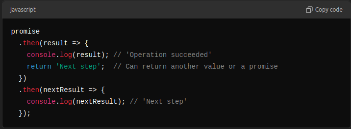
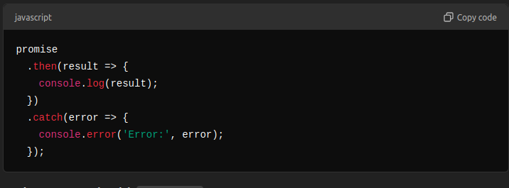
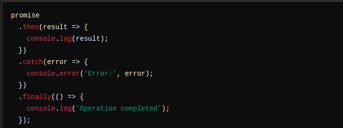

# Promises in JavaScript

A Promise is an object in JavaScript that represents the eventual completion (or failure) of an asynchronous operation and its resulting value. It is a more elegant and manageable way to handle asynchronous operations compared to traditional callbacks, helping to avoid callback hell.

# Why Use Promises?

    Better Readability: Promises allow you to chain asynchronous operations, making the code more linear and readable.
    Error Handling: Provides a single .catch() method to handle errors in the promise chain.
    Avoid Callback Hell: Reduces deeply nested callbacks.

## States of a Promise

A promise can be in one of the following states:

    Pending: Initial state; neither fulfilled nor rejected.
    Fulfilled: Operation completed successfully; the promise has a result.(insternal error like netwwork errors also my fullfill the promise)
    Rejected: Operation failed; the promise has a reason for failure.

## Once a promise is settled (fulfilled or rejected), it becomes immutable, meaning its state cannot change.

## Creating a Promise

The Promise constructor takes a function as an argument, which itself accepts two parameters:

    resolve – A function to call when the operation completes successfully.
    reject – A function to call when the operation fails.

##  Using Promises

1. Chaining Promises with .then()

The .then() method is used to handle a resolved promise and chain further operations.

2. Handling Errors with .catch()

The .catch() method is used to handle rejected promises.

3. Always Run Code with .finally()

The .finally() method runs regardless of whether the promise is fulfilled or rejected.

# example:

fetch('https://api.example.com/data')
  .then(response => {
    if (!response.ok) {
      throw new Error('Network response was not ok');
    }
    return response.json(); //it may return another promise or a value.//passed to next then
  })
  .then(data => {
    console.log('Data received:', data);
  })
  .catch(error => {
    console.error('Fetch error:', error);
  })
  .finally(() => {
    console.log('Fetch operation completed');
  });
